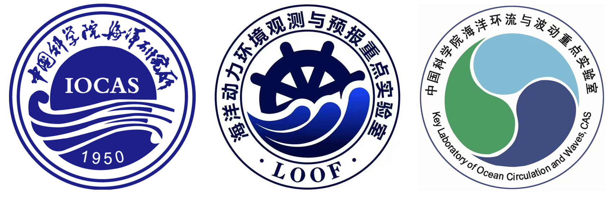
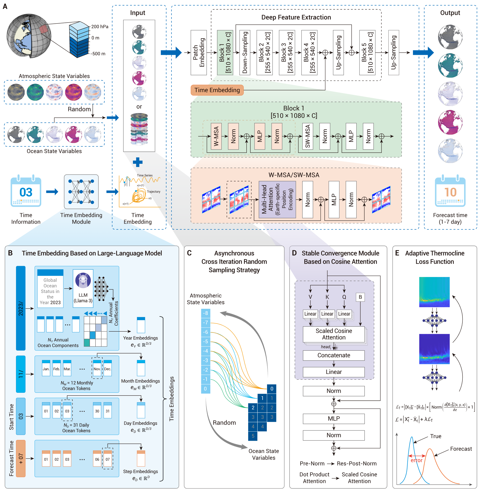

# LangYa Ocean Large Model


This repository contains the code and mdoels used for "LangYa: Revolutionizing Cross-Spatiotemporal Ocean Forecasting" \[[preprint paper](https://arxiv.org/abs/2412.18097)\]

The term *Langya* is taken from the [Ci Hai](https://en.wikipedia.org/wiki/Cihai) (Chinese Dictionary), and refers to treasures with fine textures, crystal-clear and translucent like jade. Historically, Langya Terrace, located to the south of the ancient Zhenkou Town, has served as an important center for observing celestial bodies, including the sun, moon, and stars, and is a key site related to the twenty-four solar terms. Our ocean large model is named "LangYa," which aligns perfectly with the mission it carries in the field of modern oceanography.




## Version Notes

| Release Version      | Model Weights | Training Data   | OSV |
|----------------------|---------------|-----------------|-----------------|
| Initial release v1.0  | [langya_v1.0 onnx weights](XXXXX) | ERA5, GLORY12 | Temperature, Salinity, Velocity-U, Velocity-V  | 


## Updates
- [2024/12/28] The launch event of LangYa v1.0 was successfully held at the Guzhenkou Campus of the Institute of Oceanology, Chinese Academy of Sciences, in Qingdao, China. ([Media News](XXXXX))


## References

For training and testing LangYa v1.0, we downloaded the [GLORYS12](https://data.marine.copernicus.eu/product/GLOBAL_ANALYSISFORECAST_PHY_001_024/description) and [ERA5](https://cds.climate.copernicus.eu/datasets/reanalysis-era5-pressure-levels-monthly-means?tab=download). For comparison with other methods, we downloaded the [IV-TT Class 4 framework](https://thredds.nci.org.au/thredds/catalog/rr6/intercomparison_files/catalog.html). All these data are publicly available for research purposes.

If you find this work useful, cite it using:
```
@article{yang2024lang,
      title={LangYa: Revolutionizing Cross-Spatiotemporal Ocean Forecasting}, 
      author={Nan Yang and Chong Wang and Meihua Zhao and Zimeng Zhao and Huiling Zheng and Bin Zhang and Jianing Wang and Xiaofeng Li},
      year={2024},
      eprint={2412.18097},
      archivePrefix={arXiv},
      primaryClass={physics.ao-ph},
}
```
